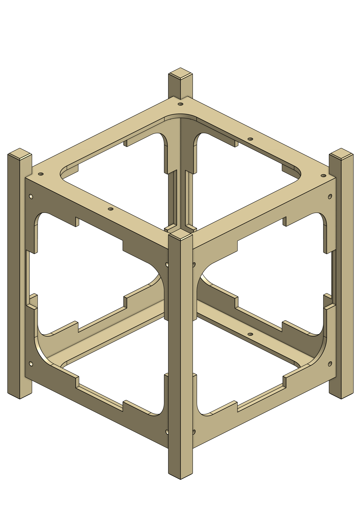
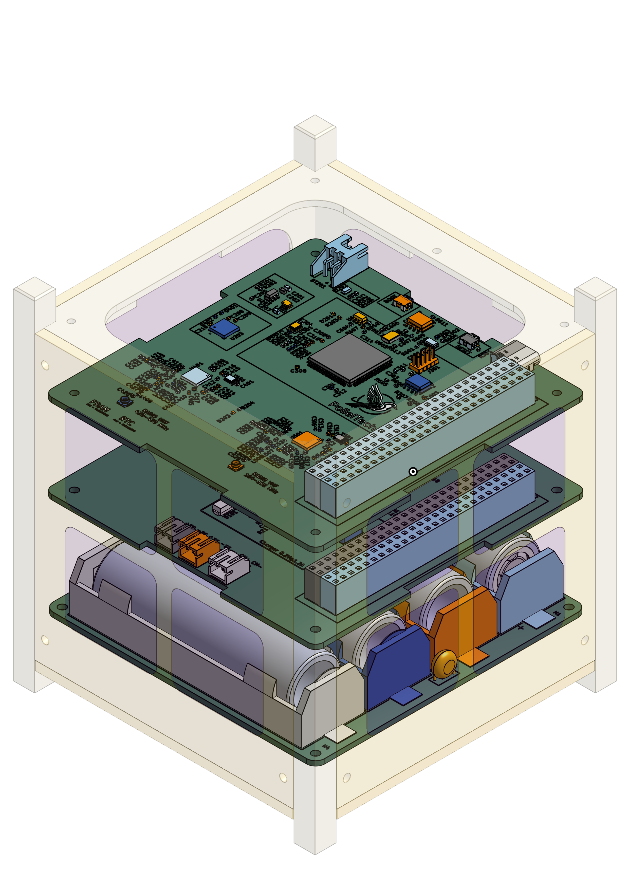
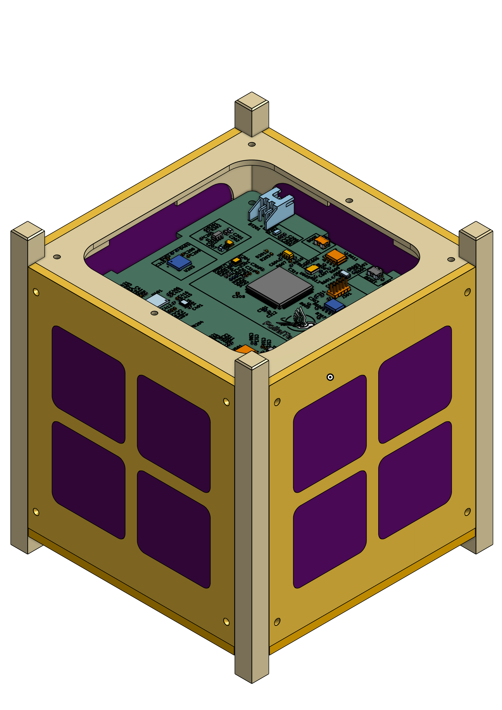
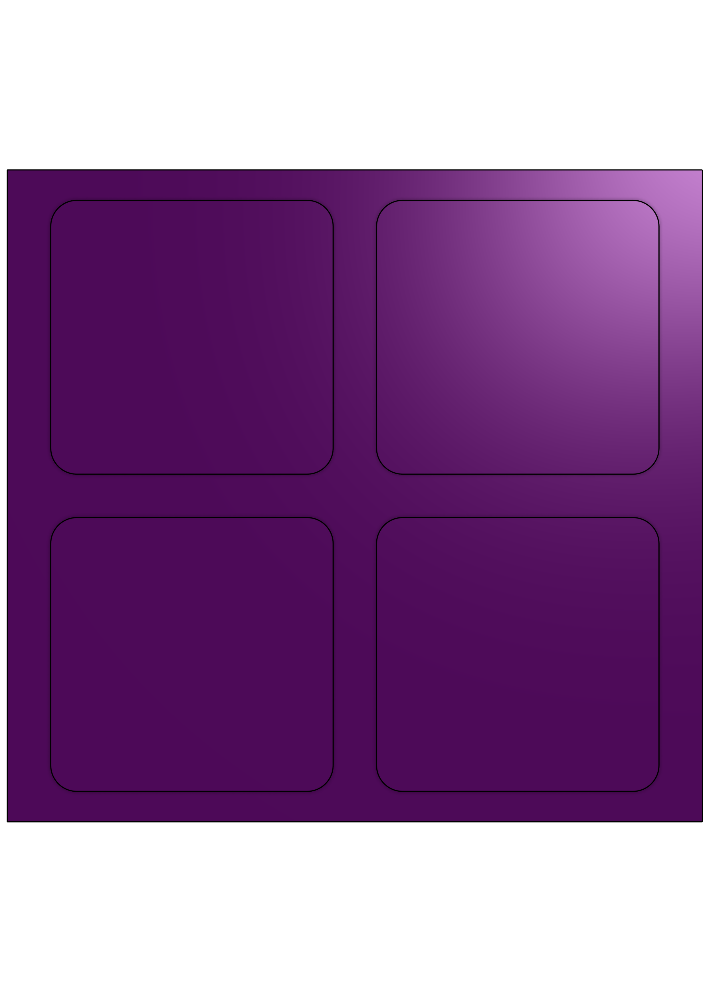
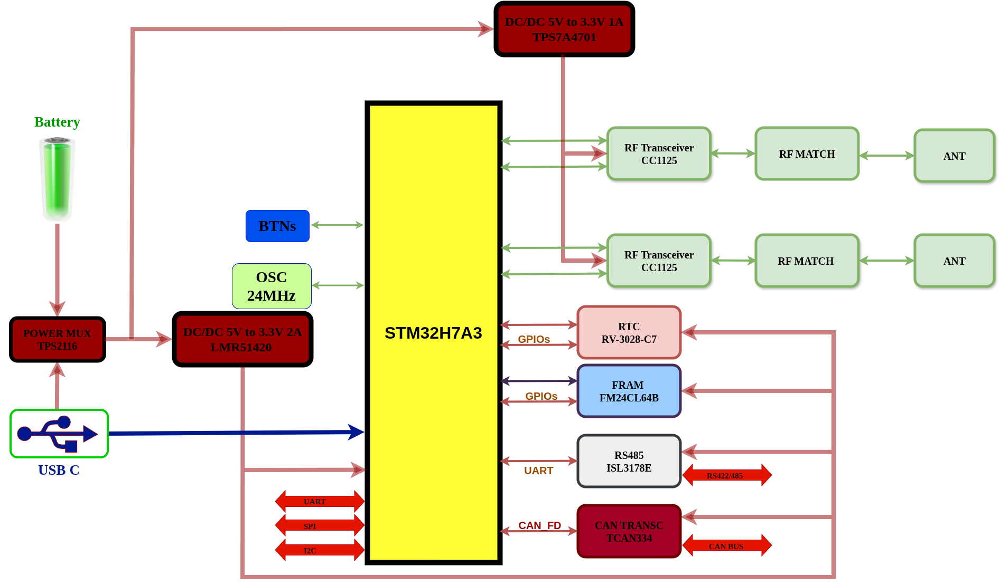

# SAHEL-CUBESAT: An Experimental Educational CubeSat 
# Project work in progress

This project aims to develop a complete experimental CubeSat for educational purposes. It is based on an STM32H7 MCU for data handling and uses two CC1125 radios for communication. The software is developed using a Zephyr-like RTOS.

<table>  <tr>    <td align="center">             <b>Mechanical Frame</b>    </td>    <td align="center">             <b>CubeSat Assembly with PCBs</b>    </td>    <td align="center">             <b>Complete CubeSat Assembly</b>    </td>  </tr></table>

## Table of Contents

- [Hardware](#hardware)
  - [Structure](#structure)
  - [Electronics](#electronics)
    - [Radio and OBC PCB](#radio-and-obc-pcb)
    - [Solar Panel and Battery PCB](#solar-panel-and-battery-pcb)

- [Software](#software)
  - [System Logic](#system-logic)
  - [Implementation](#implementation)

- [Ground Station Communication](#ground-station-communication)

---

## Hardware

### Structure

The structure was designed according to the specifications using [Onshape](https://cad.onshape.com?utm_source=chatgpt.com). All printable components can be found in this [directory](hardware/structure/).
<table>  <tr>    <td align="center">             <b>Mechanical faces X+ X- Y+ Y-</b>    </td>    <td align="center">             <b>Mechanical faces Z+ Z-</b>    </td>    <td align="center">             <b> Solar panel</b>    </td>  </tr></table>

---

### Electronics

KiCad is used for the electronic design. The hardware is divided into three parts. The first part includes the radio communication system and the OBC (On-Board Computer) for the CubeSat. The second part consists of a board integrating several sensors and a solar MPPT controller IC.

#### Radio and OBC PCB

<table>
  <tr>
    <td align="center">
      
      <b>Architectural Diagram of the Radio and OBC PCB </b>
    </td>
  </tr>
</table>

---

##### Components

###### MCU

**STM32H7B0VBTx**  
High-performance Arm Cortex-M7 MCU with DSP and DP-FPU, 128 KB Flash, 1,376 KB SRAM, up to 280 MHz.

---

###### FRAM — FM24C64C

| Parameter        | Value            |
|-----------------|------------------|
| Memory          | 64-Kbit (8K × 8) |
| I2C Address      | 0b1010000        |
| SDA (I2C3)       | PC9              |
| SCL (I2C3)       | PA8              |
| Write Protect    | PC5              |

---

###### RTC & Temperature Sensor

**RTC: RV-8523-C3**  
**TEMP: TMP100**

| Parameter        | Value            |
|-----------------|------------------|
| RTC I2C Address  | 0b1101000        |
| TEMP I2C Address | 0b1001000        |
| SDA (I2C1)       | PB7              |
| SCL (I2C1)       | PB6              |
| RTC_INT          | PB5              |
| RTC_EVI          | PB4              |

---

###### CAN Interface — TCAN334G

| Signal     | Pin  |
|-----------|------|
| CAN1_TX    | PD1  |
| CAN1_RX    | PD0  |
| CAN_SHDN   | PA15 |
| CAN_STBY   | PD2  |

---

###### RS-485 Interface — ISL3170E

| Signal      | Pin  |
|------------|------|
| UART2_RX    | PD6  |
| UART2_TX    | PD5  |
| UART2_EN    | PD4  |

---

#### Solar Panel and Battery PCB

---

## Software

### System Logic

...

### Implementation

...

---

## Ground Station Communication

...