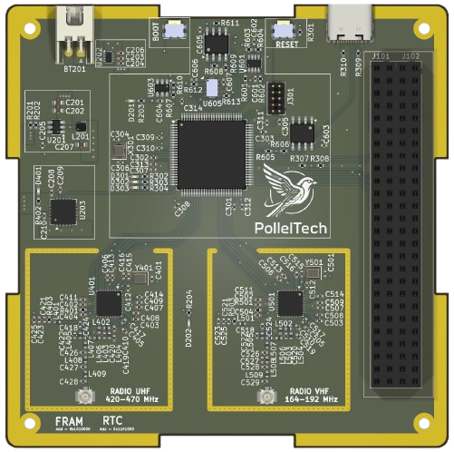
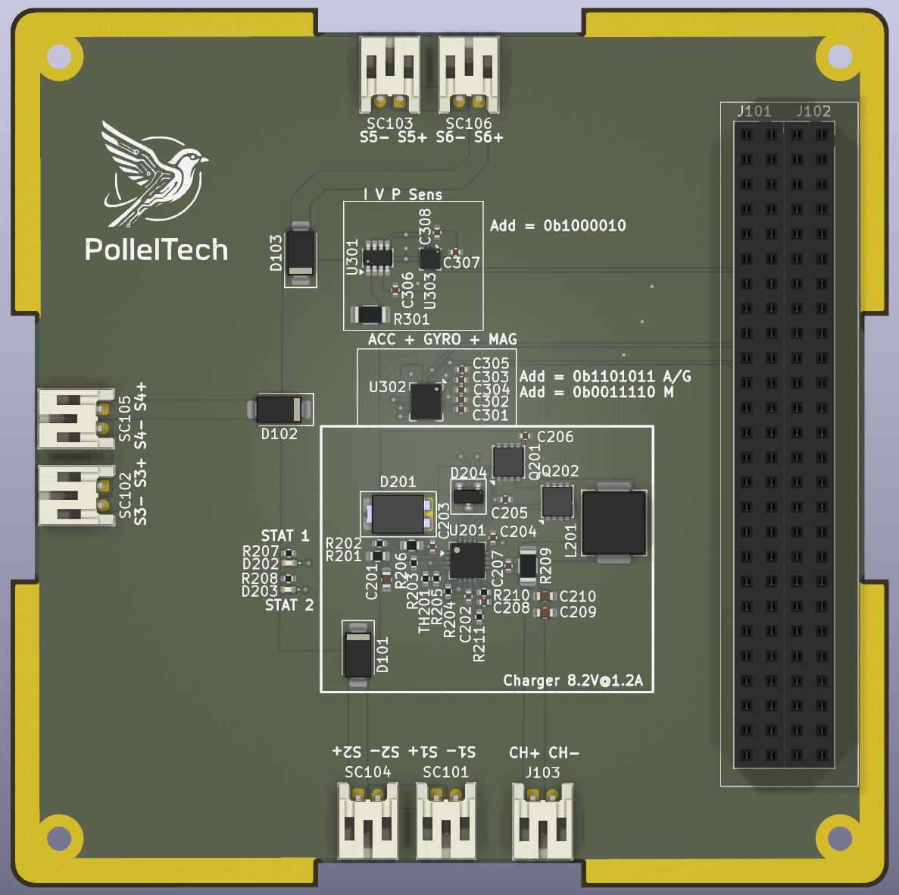
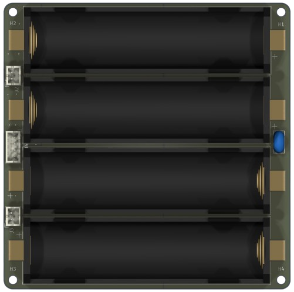

# SAHEL-CUBESAT: An Experimental Educational CubeSat 
# Project work in progress

This project aims to develop a complete experimental CubeSat for educational purposes. It is based on an STM32H7 MCU for data handling and uses two CC1125 radios for communication. The software is developed using a Zephyr-like RTOS.

<table>  <tr>    <td align="center">             <b>Mechanical Frame</b>    </td>    <td align="center">             <b>CubeSat Assembly with PCBs</b>    </td>    <td align="center">             <b>Complete CubeSat Assembly</b>    </td>  </tr></table>

## Table of Contents

- [Hardware](#hardware)
  - [Structure](#structure)
  - [Electronics](#electronics)
    - [Radio and OBC PCB](#radio-and-obc-pcb)
    - [Solar Panel and Battery PCB](#solar-panel-and-battery-pcb)

- [Software](#software)
  - [System Logic](#system-logic)
  - [Implementation](#implementation)

- [Ground Station Communication](#ground-station-communication)

---

## Hardware

### Structure

The structure was designed according to the specifications using [Onshape](https://cad.onshape.com?utm_source=chatgpt.com). All printable components can be found in this [directory](hardware/structure/).
<table>  <tr>    <td align="center">             <b>Mechanical faces X+ X- Y+ Y-</b>    </td>    <td align="center">             <b>Mechanical faces Z+ Z-</b>    </td>    <td align="center">             <b> Solar panel</b>    </td>  </tr></table>

---

### Electronics

KiCad is used for the electronic design. The hardware is divided into three parts. The first part includes the radio communication system and the OBC (On-Board Computer) for the CubeSat. The second part consists of a board integrating several sensors and a solar MPPT controller IC.

#### Radio and OBC PCB : Available in: [hardware/sahel_pcb_main](hardware/sahel_pcb_main/)

<table>
  <tr>
    <td align="center">
       
      <b>Architectural Diagram of the Radio and OBC PCB</b>
    </td>
    <td align="center">
       
      <b>Radio and OBC PCB</b>
    </td>
  </tr>
</table>

---

##### Components

###### MCU

**STM32H7B0VBTx**  
High-performance Arm Cortex-M7 MCU with DSP and DP-FPU, 128 KB Flash, 1,376 KB SRAM, up to 280 MHz.

---

###### FRAM — FM24CL64B

| Parameter        | Value            |
|-----------------|------------------|
| Memory          | 64-Kbit (8K × 8) |
| I2C Address      | `0b1010000`        |
| SDA (I2C3)       | PC9              |
| SCL (I2C3)       | PA8              |
| Write Protect    | PC5              |

###### Sensors

**Accelerometer, Gyroscope, and Magnetometer: LSM9DS1**  
**Barometer: BMP388**

| Parameter            | Value        |
|---------------------|-------------|
| I2C Address (ACC/GYRO) | `0b1101011` |
| I2C Address (MAG)      | `0b0011110` |
| I2C Address (BARO)     | `0b1110111` |
| SDA (I2C4)             | PD13        |
| SCL (I2C4)             | PD12        |
| INT_ACC/GYRO           | PE8         |
| DRDY_MAG               | PE7         |
| DRDY_BARO              | PB2         |
---

###### RTC & Temperature Sensor

**RTC: RV-8803-C7**  
**TEMP: TMP100**

| Parameter        | Value            |
|-----------------|------------------|
| RTC I2C Address  | `0b0110010`        |
| TEMP I2C Address | `0b1001000`        |
| SDA (I2C1)       | PB7              |
| SCL (I2C1)       | PB6              |
| RTC_INT          | PB5              |
| RTC_EVI          | PB4              |

---

###### CAN Interface: TCAN334G

| Signal     | Pin  |
|-----------|------|
| CAN1_TX    | PD1  |
| CAN1_RX    | PD0  |
| CAN_SHDN   | PA15 |
| CAN_STBY   | PD2  |

---

###### RS-485 Interface: ISL3170E

| Signal      | Pin  |
|------------|------|
| UART2_RX    | PD6  |
| UART2_TX    | PD5  |
| UART2_EN    | PD4  |

---
###### Radio Interface: CC1125

The CC1125 device is a fully integrated single-chip radio transceiver designed for high performance at very low-power and low-voltage operation in cost-effective wireless systems frequency bands at 164–192 MHz, 274–320 MHz, 410–480 MHz, and 820–960 MHz.

**UHF(TX/RX) 420-470 MHz**

| Signal      | Pin  |
|------------|------|
| UHF_SCK(SPI1)    | PA5  |
| UHF_MISO(SPI1)     | P6  |
| UHF_MOSI(SPI1)     | P7  |
| UHF_CS(SPI1)     | PA4  |
| UHF_GPIO2    | PC5  |
| UHF_GPIO3    | PC4  |

**VHF(TX/RX) 164-192 MHz**

| Signal      | Pin  |
|------------|------|
| UHF_SCK(SPI4)    | PE12  |
| UHF_MISO(SPI4)     | PE13  |
| UHF_MOSI(SPI4)     | PE14  |
| UHF_CS(SPI4)     | PE11  |
| UHF_GPIO2    | PB10  |
| UHF_GPIO3    | PE14  |

#### Solar Panel and Battery PCB

<table>
  <tr>
    <td align="center">
       
      <b> Solar charger PCB </b>      
    </td>
    <td align="center">
       
      <b> Battery charger PCB </b>
    </td>
  </tr>
</table>

In this project, the BQ24650 solar charger is used together with an INA219A current sensor for photovoltaic (IPV) monitoring.

| Parameter                  | Value               |
|---------------------------|---------------------|
| Input Voltage (Vin)       | 9V – 24V            |
| MPPT Voltage (VMPPT)      | 9V                  |
| Charge Voltage            | 8.2V                |
| Charge Current            | 1.2A                |
| Precharge Current         | 125mA               |
| Termination Current       | 125mA               |
| INA219A I2C Address       | `0b1000010`         |
| SDA (I2C4)                | PD13                |
| SCL (I2C4)                | PD12                |

---

### Battery Pack & Protection

The system uses four RS PRO Li-Ion batteries configured in a 2S2P arrangement with the following specifications:

| Parameter                          | Value                |
|-----------------------------------|----------------------|
| Nominal Voltage                   | 3.60V                |
| Capacity                          | 3500mAh              |
| Maximum Charge Voltage            | 4.20V                |
| Energy                            | 12.60Wh              |
| Operating Voltage                 | 4.20V – 2.50V        |
| Cut-Off Voltage                   | 2.50V                |
| Standard Charge Method            | CC-CV                |
| Standard Charge Current           | 0.2C (0.7A)          |
| Standard Charge Cut-Off Current   | 0.02C (0.07A)        |
| Maximum Continuous Charge Current | 1.0C (3.5A)          |

#### Standard Discharge Conditions

| Temperature Range | Discharge Current |
|------------------|------------------|
| 0°C – 10°C       | 0.1C (0.35A)     |
| 10°C – 20°C      | 0.2C (0.7A)      |
| 20°C – 45°C      | 0.5C (1.75A)     |

The battery protection and monitoring system is based on the BQ76907 battery monitor IC and an INA219A current sensor.

| Parameter              | Value                    |
|-----------------------|--------------------------|
| I2C Address (BQ76907) | `0b0001000` (default)    |
| I2C Address (INA219A) | `0b1000000`              |
| SDA (I2C1)            | PB7                      |
| SCL (I2C1)            | PB6                      |
| Battery Alert         | PE2                      |

---

## Software

### System Logic

...

### Implementation

...

---

## Ground Station Communication

...